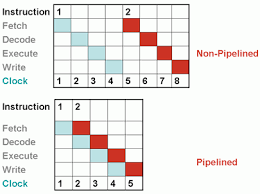
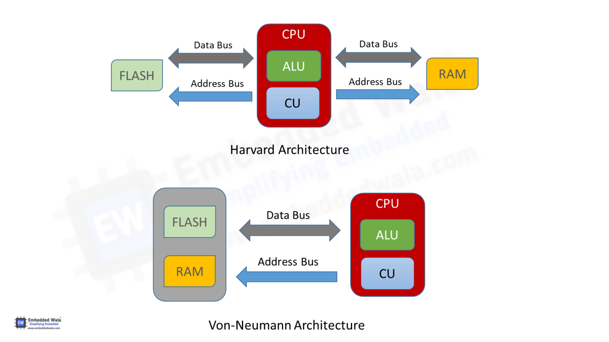
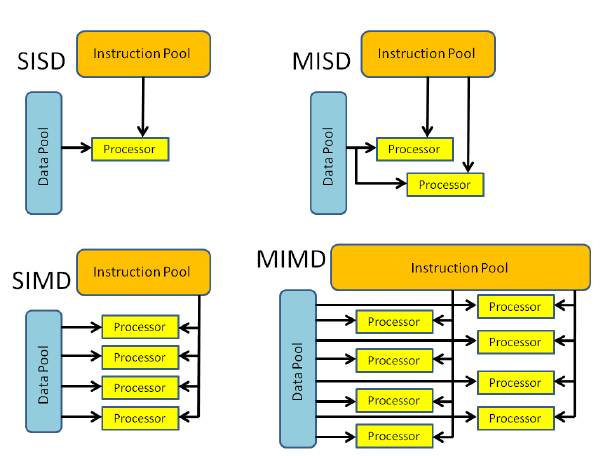

# Digital System Design 4 2018

## A1

### a)

The development of transistors has greatly reduced the gate size, allowing more and more transistors to be packed into modern processors. This rapid advancements in transistor count and computation is described by Moore's Law.

Vacuum Tubes Triodes were used before transistors. They were significantly slower, unreliable and less efficient. They can still be seen in some modern guitar amplifiers due to their supposedly warmer sonic characteristics.

### b)

The increase in market share for RISC computers, when compared to CISC computers is due to the rise of mobile and embedded devices which are more catered to executing many simple instructions, rather than the few complicated ones found in CISC computing. The popularity of ARM is also an important factor in the recent rise of RISC computing, due to their extensive line of RISC cores and open licensing.

### c)

Structural: Usually referring to the VN bottleneck, structural hazards are characteristics of the CPU architecture that prevent certain pipeline stages from being executed simultaneously.

Control: Conditional branches may stall the pipeline as the next instruction cannot be fetched until the branch outcome has been found. The stalls can be minimised with speculation, which can either be static or dynamic.

Data: Data hazards occur when the result of a previous instruction is required before the operation has been completed. This can be resolved by forwarding and/or reordering.

### d)

Pseudo-instructions provide syntactic sugar to the reader/programmer, abstracting commonly used operation, such as mv x1,x2 into their hardware implementations: addi x1,x2,0

### e)

i.

$$
CPI_{1} = 0.6*1 + 0.3*2 + 0.1*4 = 1.6
$$

$$
CPI_{1} = 0.6*2 + 0.3*3 + 0.1*4 = 2.5
$$

ii.

$$
MIPS_{1} = \frac{CR_1}{10^6*CPI_1} = \frac{800M}{1M*1.6} = 500 MIPS
$$

$$
MIPS_{2} = \frac{CR_2}{10^6*CPI_2} = \frac{1000M}{1M*2.5} = 400 MIPS
$$

iii.

M2 has lower mips, largest cycles per instruction class is class A. First, finding required CPI change to reach 500 MIPS:

$$
CPI_2 = \frac{CR_2}{10^6*MIPS_2} = \frac{1000M}{1M*500} = 2
$$

$$
CPI_2 = X*0.6 + 0.3*3 + 0.1*4 = 2
$$

$$
X = \frac{2-0.3*3 -0.1*4}{0.6} = 1.17
$$

iv.

performance change is 500/400 = 1.25x speedup.

This is representative of making the common case fast. The highest frequency instruction class would require the least relative improvement.

### f)

A speculation vulnerability allowing a process to read all memory in a given system

## B1

### a)

i.

Pipelining allows the functional blocks of a CPU to be used simultaneously by splitting the execution into stages. This allows the Clock time to be greatly reduced from the total execution time to the slowest stage, greatly increasing throughput, at the cost of some latency.

ii.

VN: Unified Instruction and Data bus, enabling flexibility between the size of instruction and data sections, a requirement for modern OSes. Unified bus introduced a structural hazard, preventing IF and MEM stages from being executed in parallel.

Harvard: Split Instruction and Data bus and memory, avoiding the structural hazard present in VN architectures, making it more suitable for the pipeline interface. The split memories comes at the cost of flexibility, which can be resolved by using a modified harvard, where memory is unified but the bus is still split.

iii.

Load/Store, typically implemented by RISC ISAs, uses a separate load/store unit, requiring specific instructions which either load or store from/to registers to memory. It follows that arithmetic operations are completed register-register

Register/Memory, typically implemented by CISC ISAs, uses longer instructions to perform arithmetic operations directly from registers to memory. 

### b)

i.

SISD: Single instruction stream, Single Data output, used by single core embedded processors, and older architectures, such as the Intel Pentium 4. 

SIMD: Single instruction stream, Multiple Data output, Applying one operation to an array of data, such as a GPU or vector extensions used in modern CPUs.

MISD: multiple instruction stream, single data output. Adding redundancy to increase security and fault-tolerance in computing.

MIMD: multiple instruction stream, multiple data output. Present in multiple-issue, multi-threaded processors, such as modern Intel i7 CPUs. Each instruction can be applied to multiple data, such as is present in vector processors.

ii.

answered above

## B2

### a)

i.

PC-relative addressing: The 2sC immediate is summed with the PC to give the branch or jump address, which is loaded into the PC in the case where the branch/jump is taken.

ii.

max is 0x200FFFFE for jump, 0x20000FFE for branch. Neither makes it.

### b)

> Can't do

### c)

> Some of these aren't RV signals so I just guessed

|Input Instr|opcode|RegDest|ALUSrc|MemtoReg|RegWrite|MemRead|MemWrite|Branch|ALUOp|
|---|---|---|---|---|---|---|---|---|---|
|slt|0110011|1|0|0|1|0|0|0|R-format|
|lw |0000011|1|1|1|1|1|0|0|I-format|
|bne|1100011|X|0|0|0|0|0|1|SB-format|

## B3

### a)

i.

To achieve the space and cost efficiency of hard disk/Flash SSD, while keeping the speed of cache (SRAM) memory, by exploiting temporal and spatial locality.

ii.

Spatial locality: memory accesses near to each other are more likely to hit as, depending on the block size, nearby memory is also loaded on a hit. This type of locality is exploited in contiguous arrays (data cache) and sequential code execution (instruction cache).

Temporal Locality: Nearby memory accesses performed close to each other will increase the chance of a cache hit as recently used data is stored in the cache. Loops result in recently used data being reused (data cache) and recently loaded instructions being rerun (instruction cache).

### b)

i.

Block Size = 64B

Block No. = 32KiB/64B = 512

ii.

Index bits = 9b

iii.

Block offset = 6b

Tag bits = 32 - 9 - 6 = 17b

### c)

i.

Tag = 19b

Index = 7b

Block offset = 6b

ii.

increasing associativity increases the cache hit rate, due to the higher flexibility, reducing conflict misses.

iii.

Instruction cache -> no write scheme -> no dirty bit

|Valid|LRU|Tag|Index|Offset|
|---|---|---|---|---|
|1b|2b|19b|7b|6b|

