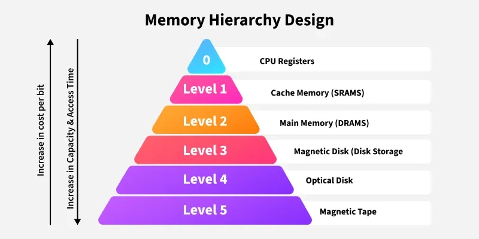

# Digital System Design 4 2019

## A1

### a)


VN: Unified Instruction and Data bus, enabling flexibility between the size of instruction and data sections, a requirement for modern OSes. Unified bus introduced a structural hazard, preventing IF and MEM stages from being executed in parallel.

Harvard: Split Instruction and Data bus and memory, avoiding the structural hazard present in VN architectures, making it more suitable for the pipeline interface. The split memories comes at the cost of flexibility, which can be resolved by using a modified harvard, where memory is unified but the bus is still split.

### b)

i.

Static arch rely on the compiler ordering the instructions in the most efficient way, maximising functional block usage.

Dynamic arch use a reorder buffer to enable out-of-order execution, increasing flexibility and reducing stalls at runtime. This requires more complex hardware to avoid hazards, but typically results in better performance than static multiple-issue processors.

ii.

Loop unrolling is the process of completing multiple iterations in the body of a loop, achieving 2 goals: reducing the time spent on branch speculation and increase the potential for parallelism with register renaming.

### c)

i.

for 1: 20 + 10,000 = 10,020

for 10: 20 + 1,000 = 1,020

speedup = 9.8x

for 100: 20 + 100 = 120

speedup = 83.5x

ii.

Amdahl's Law, You can only improve the workload of a process by the improvable portion of the workload. Only the parallelisable part of the workload can be parallelised.

iii.

The most heavily loaded processor would bottleneck the execution time.

### d)

i.

1w = 4B, read + write = 8B of mem per 4 FLOP

FLOPs/mem = 1/2

Processor B is faster

ii.

Double memory bandwidth, could be done with software prefetching or greater memory affinity

## B1

### a)

> Translating code into RV:

    slli    t0, s3, 2
    add     t0, t0, s6
    lw      t0, 0(t0)
    slli    t1, s4, 2
    add     t1, t1, s6
    lw      t1, 0(t1)
    add     t2, t0, t1
    sw      t2, 32(s7)

i.

R-format: add

I-format: lw, slli

ii.

> Use suitable RV equivalents

|instr|opcode|rs1|rs2|rd|funct3|funct7|
|---|---|---|---|---|---|---|
|add|0110011|t0|t0|s6|000|0000000|
|add|0110011|t1|t1|s6|000|0000000|
|add|0110011|t2|t0|t1|000|0000000|

iii.

1. 0000 0000 0101 0010 1000 1011 0011 0011 -> 0x00528B33

2. 0000 0000 0110 0011 0000 1011 0011 0011 -> 0x00630B33

3. 0000 0000 0101 0011 1000 0011 0011 0011 -> 0x00538333

### b)

i.

|instr|Instruction Mem|Reg File|ALU|Imm Gen| Data Mem | 
|---|---|---|---|---|---| 
|lw|1|1|1|1|1 | 
|add|1|1|1|0|0 | 
|sw|1|1|1|1|1 | 

ii.

Use table above and Block diagram in the slides

### c)

Translating code into functional operations:
Block space is 4B, assume int

```c
t0 = s6[s3]; // first 3 lines
t1 = s6[s4]; // next 3 lines
s7[8] = t0 + t1; // last 2
```
convert from raw disassembly into a more standard format by assuming s3 = i, s4 = j, s6 = &A, s7 = &B:

```c
B[8] = A[i] + A[j];
```

## B2

### a)

> not relevant

### b)

i.

not possible in RV. Jump instructions follow the UJ format which provides bits 20:1 of a 21b 2sC number, giving a max range of -0x100000 to 0xFFFFE.

ii.

not possible in RV, same as above but for 13b 2sC number. range is -0x1000 to 0xFFE.

iii.

PC-relative addressing

### c)

i.

subtraction, check if result is zero, if so set the zero reg to 1.

ii.

need to negate the zero reg, then pass it into and gate, along with the branch control signal. 

## B3

### a)

i.



purpose is to have the capacity and cost of hard-disks with the access time of cache/CPU regs

ii.

Spatial locality: memory accesses near to each other are more likely to hit as, depending on the block size, nearby memory is also loaded on a hit. This type of locality is exploited in contiguous arrays (data cache) and sequential code execution (instruction cache).

iii.

Temporal Locality: Nearby memory accesses performed close to each other will increase the chance of a cache hit as recently used data is stored in the cache. Loops result in recently used data being reused (data cache) and recently loaded instructions being rerun (instruction cache)

iv.

Key purpose is to allow processes to have their own contiguous memory space, without the need to worry about fragmentation, providing memory safety.

Also allows processes to have more space than is available, by using swap space on the disk for temporary memory storage.

### b)

i.

Block size = 64B

Block number = 512

Set number = 128

ii.

Index bits = 7b

Block offset = 6b

iii.

Tag bits = 19b

iv.

Diagram would just be an address block with the size corresponding the bit number for each section

Tag =17b, Index = 9b, BO = 6b

### c)

i.

Hit time decreases, miss rate increases, miss penalty decreases

ii.

Hit time increases (more data to load), miss rate increases, as 64B is optimal block size so memory pollution will start to drive the miss rate up, miss penalty increases, same reason as hit time

iii.

Hit time decreases, no need to write to RAM on every write.

Miss rate stays the same, fewer accesses to RAM will be made but this is not considered a miss.

Miss penalty is increased, misses result in a replacement, which needs to be checked with the RAM (if dirty). In write through misses only result in memory being written on writes.


