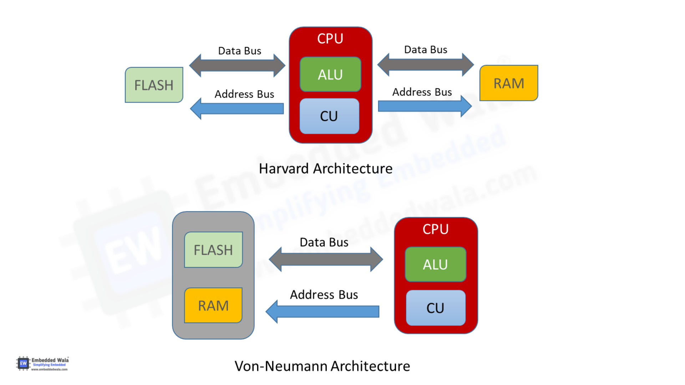

# Digital System Design 4 2024
## A1

### a)



Von Neumann architecture includes a unified bus and memory for data and instructions. This creates a structural hazard when paired with a pipelined processor, preventing IF from being executed in parallel with MEM, aka the VN bottleneck. VN is useful for treating applications as programs, storing instructions and data locally. 

Harvard architecture uses separate memories and buses, while modified harvard uses a combined data and instruction memory with a split bus, getting the convenience of VN programs with the pipelining performance of Harvard archs. 

### b)

i.

$$
CPI_1 = 4*0.3 + 5*0.2 + 2*0.5 = 3.2
$$
CPI2 = 4.3

MIPS1 = 312.5
MIPS2 = 279.1 

ii.

2nd is slower, change class C down to 2

CPI2 = 3.8

MIPS2 = 315.8

### c)

lui  x20, 0x1A2B3
addi x20, x20, 0xC4D

### d)

            addi x20, x18,0     // p = &A[0]
            addi x21, x19,-2    // x21 = size -2
            slli x21, x21, 2    // x21 = (size -2)*4
            add  x21, x21, x18  // x21 = &A[size-2]
    START:  bge  x20, x21, DONE // if p >= &A[size-2]
            lw   x24, 0(x20)    // x24 = *p
            lw   x23, 4(x20)    // x23 = *(p+1)
            not  x24, x24       // x24 = ~x24
            and  x23, x23, x24  
            sw   x22, 8(x20)  
            addi x20, x20, 4
            j    START
    DONE: 

## B1

### a)

i.

0x0086a583 = 0000 0000 1000 0110 1010 0101 1000 0011

opcode = 000 0011 -> load instruction

offset = 8

rs1 = 01101 = D = x13

funct3 = 010 = 2 -> lw

rd = 01011 = B = x11

lw x11, 8(x13)

ii.

Base Addressing, instruction format includes: Imm, rs1, rs2.

Physical implementation: 

ID: rs1 and rs2 are read from the register file, immediate is sign extended from the instruction.

EXE: address is calculated from from Imm + rs1. Write data is taken from rs2. 

MEM: Write address and write data are passed to data mem

iii.

opcode = 1100011, imm = -20 = 1111 1110 1111, rs1 = x12 = 01100, rs2 = 0 = 00000

1111 1110 0000 0110 0001 0110 1110 0011

0xFE0616E3

### b)

i.

bne executes a subtraction and checks if it equals zero. Seeing as we want to branch when the subtraction does not equal zero, the zero signal has to be inverted with a not gate before performing an AND with the branch control signal. The immediate also must be shifted left by **one** before the PC addition, but after it is passed to the integer ALU.  

ii.

Branch = 1, MemRead = 0, MemtoReg = X, ALUOp = bne, MemWrite = 0, ALUSrc = 0, RegWrite = 0

### c)

i.

non-pipe = 250 + 150 + 350 + 250 + 100 = 1100ps

pipe = 350*5 = 1750ps

Single cycle takes the max prop delay of an entire cycles, pipelined processors increase throughput, but the latency of a single instruction is limited by the slowest stage. Every stage needs to run at the prop delay of the slowest one

ii.

```
LOOP:
lw   x10, 0(x13)    IF  ID  EXE MEM WB
lw   x11, 8(x13)        IF  ID  EXE MEM WB
or   x12, x10, x11          IF  --  ID  EXE MEM WB 
sw   x12, 16(x13)               --  IF  ID  EXE MEM WB        
addi x13, x13, 16                           IF  ID  EXE MEM WB
bne  x12, x0, LOOP                              IF  ID  EXE MEM WB
```

## B2

### a)

i.

Only the parallelisable part of the workload can be improved by increasing parallelism. Strong scaling relies on fixed problem size

ii.

